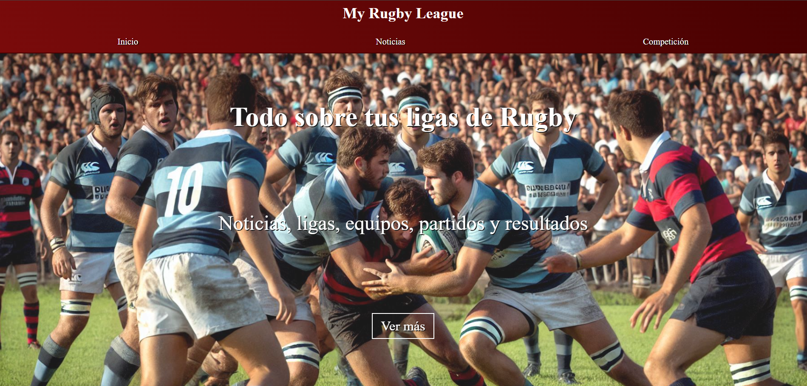

# Trabajo Fin de Curso para el Bootcamp Fullstack de Neoland

[](https://app.netlify.com/sites/proyecto-liga-vue/deploys)

Repositorio de José Ramón Carralero para el trabajo de fin de curso para el Bootcamp de Fullstack de Neoland.

Este proyecto es la parte pública del proyecto original [proyecto-liga](https://github.com/JRamonCarralero/proyecto-liga) creando el front con el framework de [VueJs](https://vuejs.org/)

## Descripción

La aplicación consiste en una web para la visualización de noticias e información sobre distintas ligas de rugby. Como base de datos usamos MongoDB, ubicada en Mongo Atlas.

Puedes visitar la aplicación desplegada en: [My Rugby League](https://proyecto-liga-vue.netlify.app/)



En la página podremos encontrar 3 apartados

* Página de inicio, que muestra las 3 últimas noticias y la tabla de clasificación de la liga marcada como principal
* Página de noticias, con buscador, paginación y detalle de noticias
* Página de competición, con la información de las distintas ligas (equipos, jugadores, jornadas, partidos, clasificaciones, estadísticas)

El código front está realizado en javascript con el framework de VueJS

En este repositorio se aplican los conocimientos adquiridos durante el curso:

* HTML
* CSS (Responsive)
* JavaScript: programación funcional, principios Solid, patrones de diseño
* VueJS para la creación de Web Components
* Servidor node.js con Express.js
* Base de datos MongoDB ubicada en Mongo Atlas, comunicación con el servidor por medio del archivo server.mongodb.js
* JSdocs para la documentación
* GitHub para gestión de repositorios
* GitHooks y Linters para comprobación de errores en el código
* Archivo api.mjs en la carpeta netlify/functions para poder desplegar el servidor en netlify, y netlify.toml en la raiz para su configuración

## Dependencias de la aplicación

* Node >= 20.0.0
* Express
* MongoDB
* JSDoc
* ESLint
* Lint-Staged
* StyleLint
* Vue
* Vue-router
* Pinia
* Netlify (sólo si se va a desplegar en netlify)

## Plugings de VS Code recomendados

* [commitlint](https://marketplace.visualstudio.com/items?itemName=joshbolduc.commitlint)
* [Conventional Commits](https://marketplace.visualstudio.com/items?itemName=vivaxy.vscode-conventional-commits)
* [Error Lens](https://marketplace.visualstudio.com/items?itemName=usernamehw.errorlens)
* [ESLint](https://marketplace.visualstudio.com/items?itemName=dbaeumer.vscode-eslint)
* [GitHub Pull Requests](https://marketplace.visualstudio.com/items?itemName=GitHub.vscode-pull-request-github)
* [Live Preview](https://marketplace.visualstudio.com/items?itemName=ms-vscode.live-server)
* [markdownlint](https://marketplace.visualstudio.com/items?itemName=DavidAnson.vscode-markdownlint)
* [Postman](https://marketplace.visualstudio.com/items?itemName=Postman.postman-for-vscode)
* [Stylelint](https://marketplace.visualstudio.com/items?itemName=stylelint.vscode-stylelint)

## Instalación y ejecución

```bash
npm install
```

Ejecutar en el terminal el servidor del backend y en otro terminal el servidor de front de VueJS.

```bash
npm run server:express:start
npm run dev
```

Una vez en ejecución, podemos acceder al front end de la aplicación en: [http://127.0.0.1:3333](http://localhost:3333)

La configuración de los puertos está definida en el archivo .env, no incluído en el repositorio de git.

La aplicación gestiona los datos por medio de MongoDB.

En lo relativo al interfaz, se aplican estilos responsive en función del tamaño de la pantalla para su uso en distintos dispositivos, con elementos Grid y Flex para esta funcionalidad.

Cada función/componente se ha creado intentando cumplir con los estándares de SOLID.

Existe la validación de tipados por medio de JSDoc en los comentarios, y ESLint tanto en los Git Hooks como apoyo por medio del plugin de VS Code.

## Documentación

Para generar la documentación de la aplicación se usa [JSDoc](https://jsdoc.app) y se guarda en la carpeta ```out```. Para verla puedes ejecutar el comando ```npm run build:docs```.

## Modelo de Datos

AccionesPartido = {
    _id
    partidoId
    minuto
    jugadorId
    equipoId
    accion
}

Clasificacion = {
    _id
    ligaId
    equipoId
    puntos
    partidosJugados
    partidosGanados
    partidosEmpatados
    partidosPerdidos
    puntosAnotados
    puntosRecibidos
}

Equipo = {
    _id
    nombre
    poblacion
    direccion
    estadio
}

EstadisticaJugador = {
    _id
    ligaId
    equipoId
    jugadorId
    ensayos
    puntosPie
    puntos
    tAmarillas
    tRojas
}

Jornada = {
    _id
    fecha
    numero
    ligaId
}

Jugador = {
    _id
    nombre
    apellidos
    nacionalidad
    altura
    peso
    equipoId
}

Liga = {
    _id
    nombre
    year
    equipos
    main
}

Noticia = {
    _id
    fecha
    titulo
    cabecera
    imagen
    contenido
}

Partido = {
    _id
    jornadaId
    ligaId
    local
    visitante
    puntosLocal
    puntosVisitante
    puntosCLocal
    puntosCVisitante
    jugadoresLocal
    jugadoresVisitante
    fecha
    jugado
}

## pre-commit

Integramos [lint-staged] para ejecutar las validaciones antes de  ejecutar el commit.

```bash
#!/usr/bin/env sh

echo PRE-COMMIT GIT HOOK
npx lint-staged
```
